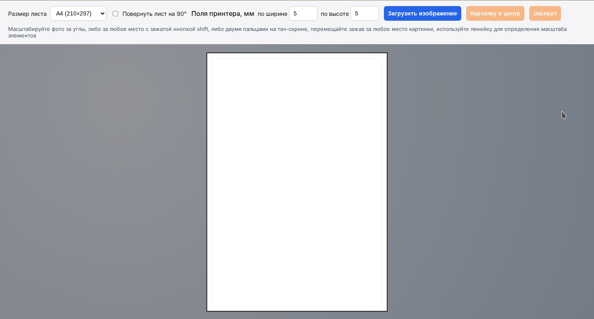
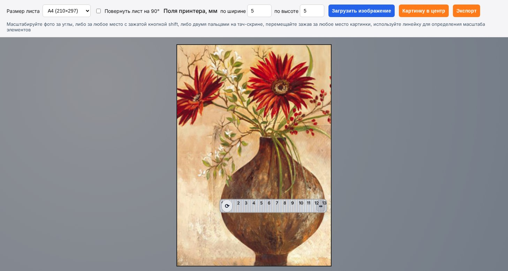

# image-scaler-js

Веб-приложение помогает быстро подобрать масштаб изображения перед печатью. В нём можно указать формат листа (A5/A4/A3 или произвольные размеры в миллиметрах), задать реальные поля принтера, загрузить фотографию и вписать её в виртуальный лист. Изображение можно перемещать, пропорционально масштабировать (мышью, жестами или с зажатым Shift) и видеть рамку будущей печати.

Чтобы оценить реальные размеры объектов на снимке, поверх кадра располагается интерактивная линейка. Её можно перемещать, поворачивать и менять длину — деления и подписи на ней соответствуют масштабу выбранного листа и помогают понять, каким будет итоговый размер деталей после печати.

Готовое изображение экспортируется в PNG: берётся только видимая часть в пределах рамки листа, поля вокруг заполняются белым, а разрешение рассчитывается без лишнего апскейла. Имя файла формируется на основе названия исходной фотографии и выбранного формата.

[Попробовать](https://mihanentalpo.github.io/image-scaler-js/)

## Скриншоты:

Исходный вид интерфейса:

Интерфейс с открытой картинкой:

